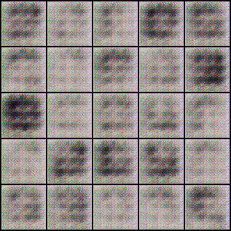
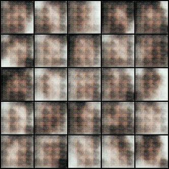
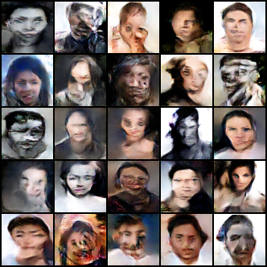

# Human Face Generator GAN

This project implements a Generative Adversarial Network (GAN) to generate realistic human faces from scratch. The model trains using a dataset of human faces and progressively improves the quality of generated images over multiple epochs.

## Sample Outputs

Below are examples of generated images from the first and last training epochs:

**First Epoch Output:**


**Second Epoch Output:**


**Last Epoch Output:**


## Features
- Implements a Deep Convolutional GAN (DCGAN) for high-quality face generation.
- Uses a discriminator network to distinguish real faces from generated ones.
- Trains a generator network to produce increasingly realistic human faces.
- Supports adjustable hyperparameters for experimentation.

## Installation
To set up the project, install the required dependencies:
```bash
pip install torch torchvision numpy matplotlib tqdm
```

## Training the Model
Run the following command to train the GAN:
```bash
python train.py
```

Training progress will be saved in the `output` directory, and checkpoints will be stored periodically.

## Usage
To generate faces from a trained model:
```bash
python generate_faces.py --model checkpoint.pth
```
Generated images will be saved in the `generated_faces` directory.

## Dataset
This GAN is trained on the [CelebA](http://mmlab.ie.cuhk.edu.hk/projects/CelebA.html) dataset, which contains diverse human face images.

## Results
- Early training epochs produce blurry and unrealistic images.
- With more epochs, the model learns fine details and structure, leading to highly realistic face generation.

## Future Improvements
- Implement conditional GANs for attribute-based face generation.
- Train on larger and more diverse datasets for improved realism.
- Optimize architecture for faster convergence.

## Acknowledgments
Special thanks to the deep learning community for resources on GAN architectures and training methodologies.

## License
This project is open-source and available under the MIT License.

